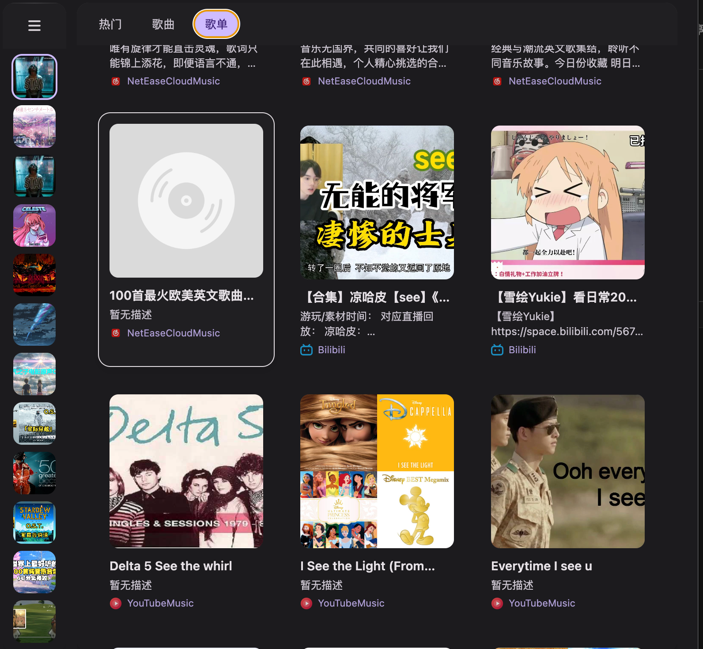
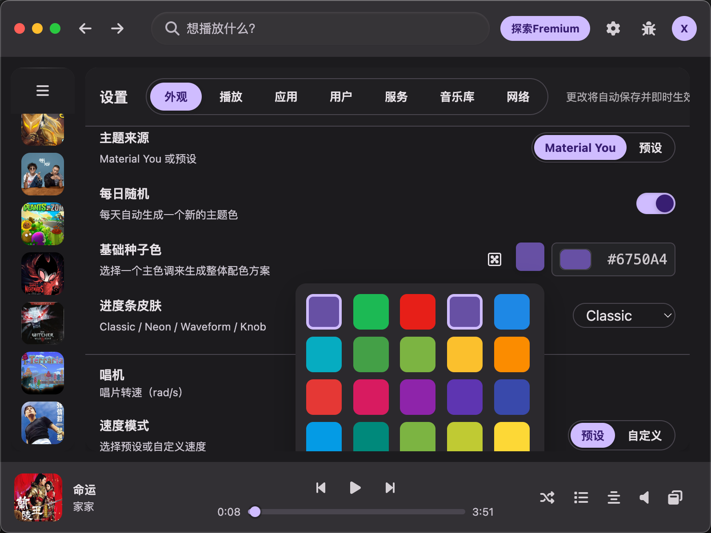
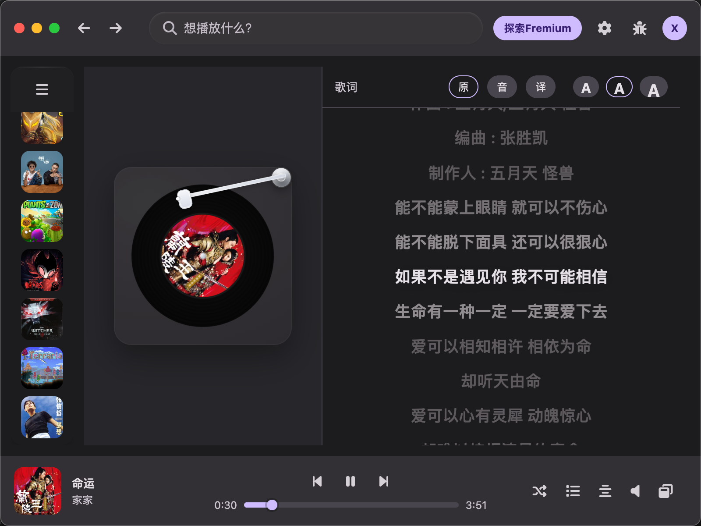
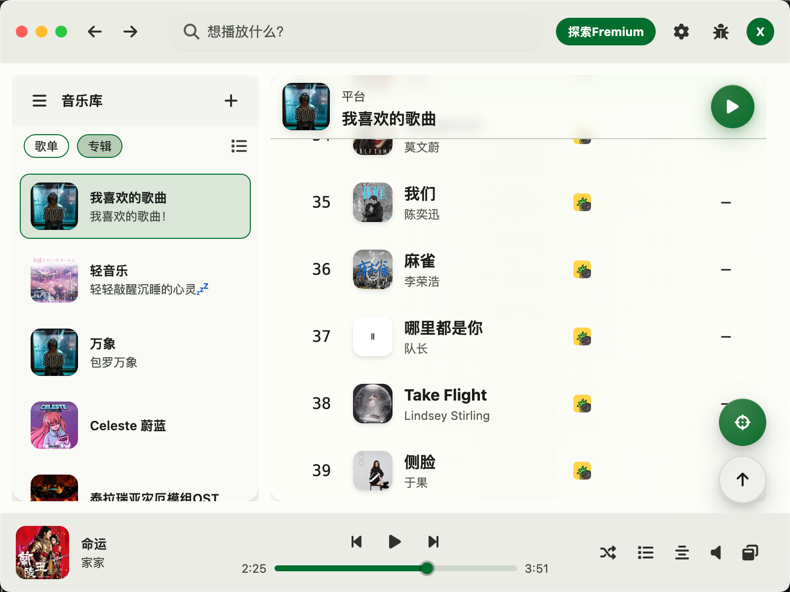
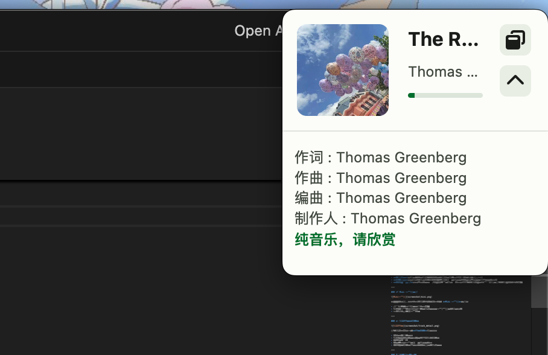
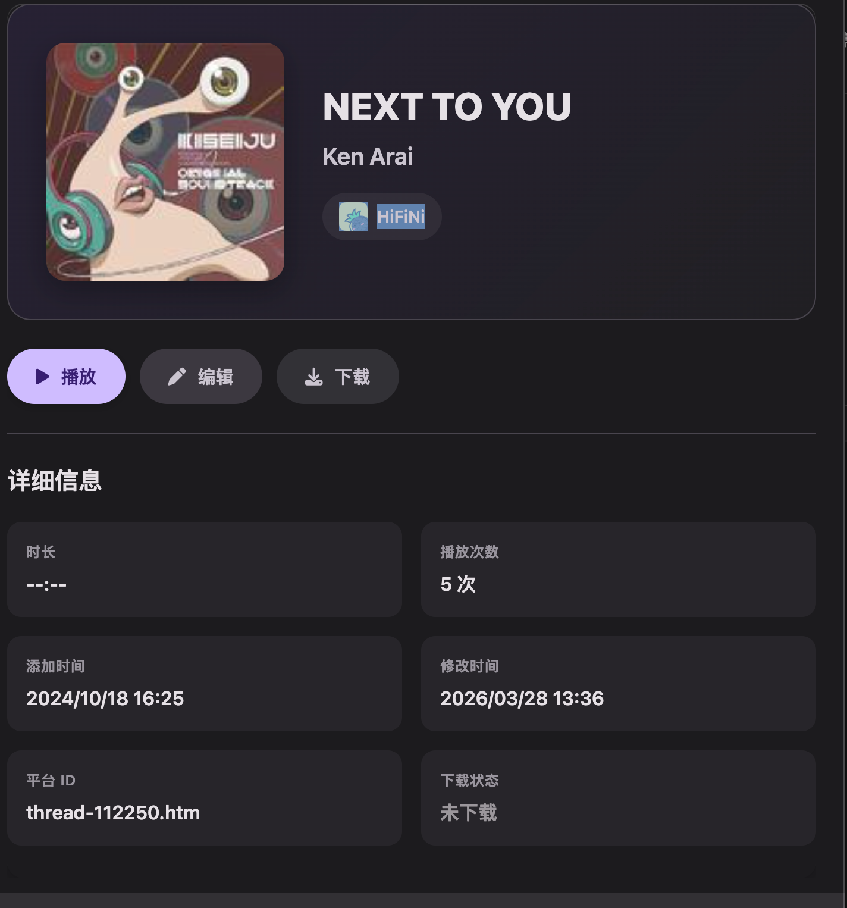
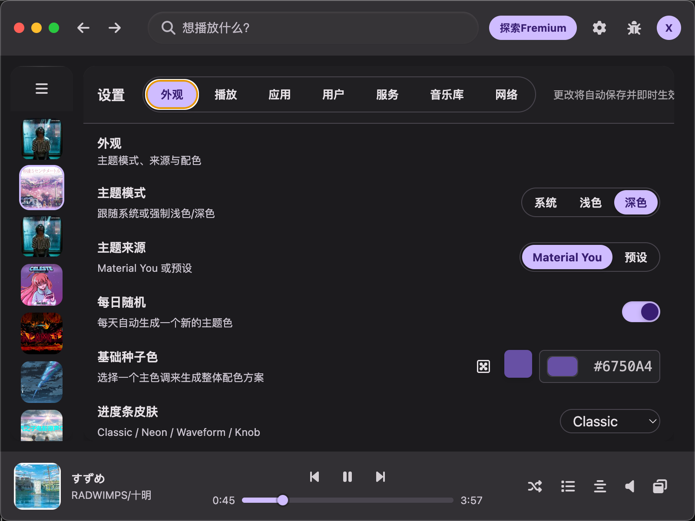

# 🎵 FreeFlow

### 自由聆听，无界音乐

**一站式聚合多平台音乐的现代桌面播放器**

---

## ✨ 项目简介

在音乐版权割据的时代，用户常常需要在多个音乐 App 之间反复切换——一首歌在 QQ 音乐，另一首在网易云，MV 在 B 站，而喜欢的小众曲目可能只在 YouTube 上才能找到。

**FreeFlow** 正是为了解决这一痛点而生。它是一款跨平台桌面音乐播放器，将来自网易云音乐、QQ 音乐、Bilibili、YouTube Music、YouTube 等多个平台的海量音乐资源聚合在一个优雅的界面中，让你只需一个应用、一次搜索，就能畅听全网音乐。

---

## 🎯 核心功能

### 🌐 全平台音乐聚合搜索

FreeFlow 内置了**六大音乐数据源**的统一对接：

| 平台 | 搜索 | 播放 | 歌词 |
|:---:|:---:|:---:|:---:|
| 网易云音乐 | ✅ | ✅ | ✅ |
| QQ 音乐 | ✅ | ✅ | ✅ |
| Bilibili | ✅ | ✅ | — |
| YouTube Music | ✅ | ✅ | ✅ |
| YouTube | ✅ | ✅ | — |
| 本地文件 | ✅ | ✅ | — |

只需在搜索栏输入关键词，FreeFlow 会同时向所有已启用的平台发起请求，将结果**自动聚合、去重**后以统一格式呈现——你甚至无需知道这首歌来自哪个平台。

搜索结果按 **"推荐"、"歌曲"、"歌单"** 三大 Tab 分类展示，让信息层次清晰、操作直觉流畅。

- **多平台结果一目了然**：每首歌曲旁标注来源平台图标，清晰区分来自网易云、QQ 音乐、B 站还是 YouTube
- **右键快捷操作**：对搜索结果中的任意歌曲右键，即可播放、加入播放队列、收藏到歌单或下载
- **即搜即播**：双击搜索结果直接开始播放，零等待体验

---

### 🎨 Material You 动态主题系统

FreeFlow 完整实现了 Google **Material You** 设计语言的动态配色系统：

- **自定义 Seed Color**：选择任意一个颜色作为主题种子色，系统会自动派生出数十个和谐的色彩角色（Primary、Secondary、Tertiary、Surface 等多层级颜色）
- **深色 / 浅色模式**一键切换：所有色彩变量同步响应，过渡流畅自然  
- **全局一致性**：从顶栏、侧边栏到播放器控制条、设置面板，所有 UI 元素统一遵循 Material You 色彩规范

> 你看到的不是静态的"换肤"，而是真正基于色彩科学的**动态色彩演算**。

---

### 🎶 沉浸式歌词体验

点击播放栏即可进入精心设计的歌词界面：

- **黑胶唱机动画**：左侧呈现经典的黑胶唱片旋转效果，播放时缓缓转动，暂停时优雅停止
- **逐行高亮歌词**：精确到毫秒级的歌词同步滚动，采用二分查找算法高效定位当前行
- **多语种切换**：支持原文歌词、发音（罗马音/拼音）、翻译三种模式自由切换
- **点击跳转**：点击任意歌词行可直接跳转到对应播放位置
- **跨平台歌词补全**：当原始平台没有歌词时，FreeFlow 会自动跨平台搜索最佳匹配，使用 Levenshtein 距离算法智能排序候选结果，以 Round-Robin 策略从多个平台轮流尝试，确保最大概率找到可用歌词

---

### 📋 播放列表与歌单管理

- **创建与编辑歌单**：自定义标题、描述和封面
- **拖拽排序**：歌单列表与歌曲列表均支持拖拽排序，操作带有流畅的物理动画反馈
- **右键菜单**：对歌曲或歌单右键即可快速操作——添加到歌单、收藏到音乐库、查看详情、下载等
- **可折叠侧边栏**：音乐库支持展开/折叠两种形态，展开时显示详细列表，折叠后以图标网格模式呈现，最大化内容区域

---

### 🪟 Mini 播放器模式

当你需要专注于其他工作时，可以切换至精致的 **Mini 播放器**模式：

- 小巧悬浮窗设计，不遮挡工作区域
- 完整的播放控制能力：封面、歌曲信息、播放/暂停、切歌、音量
- 实时同步主窗口播放状态

---

### 🔍 歌曲详情与元数据

每首歌曲都有专属的**详情页面**，展示：

- 高清专辑封面展示
- 歌曲名、艺术家、专辑、时长等完整元数据
- 来源平台标识
- 快捷操作：播放、添加到歌单、下载
- 可编辑的元数据字段：允许手动修正歌曲信息

---

### ⚙️ 全功能设置中心

设置中心提供**七大配置面板**，涵盖应用的方方面面：

| 面板 | 功能 |
|---|---|
| 🎨 外观 | 主题模式、Seed Color、自定义配色 |
| ▶️ 播放 | 播放行为、音频设置 |
| 📱 应用 | 窗口行为、系统集成 |
| 👤 用户 | 账户与登录管理 |
| 🔌 服务 | 数据源开关——逐个启用/禁用各音乐平台 |
| 📁 音乐库 | 本地音乐扫描路径、支持格式 |
| 🌐 网络 | 代理、连接配置 |

---

### 💾 本地缓存与离线播放

- **智能音频缓存**：已播放的音频文件自动缓存到本地，下次播放时直接从磁盘读取，无需重新请求网络
- **缓存容量管理**：支持设置最大缓存限额，防止磁盘空间被过度占用
- **音频代理服务**：内置本地音频代理服务器，支持 HTTP Range 请求（拖动进度条）、403 自动重试、直链缓存等高级特性，确保播放流畅不卡顿

---

### 🔌 数据源热插拔

在设置中心的"服务"面板中，每个音乐平台都可以像开关一样**独立启用或禁用**——无需修改代码或重启应用：

- 在国内网络环境下，关闭 YouTube 相关源以加速搜索
- 只想听国内平台？一键禁用海外源
- 新增数据源后，只需实现统一接口即可无缝接入

---

### 📥 歌曲下载

FreeFlow 支持将歌曲从网络资源下载到本地：

- 下载进度实时反馈
- 自动解压 ZIP 包并提取 FLAC 等高品质音频文件
- 下载任务注册与管理机制，防止重复下载

---

### 🖥️ 系统级深度集成

- **系统托盘**：最小化到系统托盘，后台持续播放
- **全局快捷键**：在任意应用中通过快捷键控制 FreeFlow 播放
- **跨平台支持**：macOS / Windows / Linux 三平台可用

---

*FreeFlow — 让音乐自由流动*

